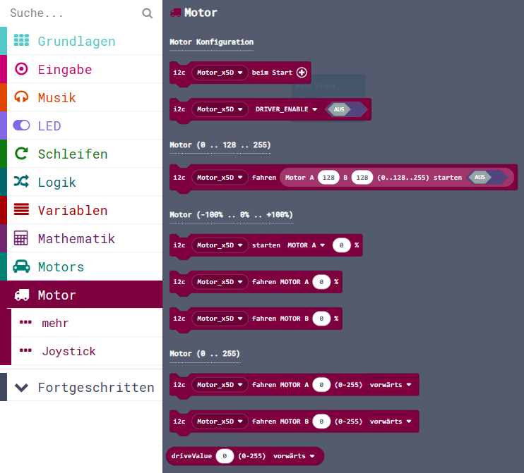
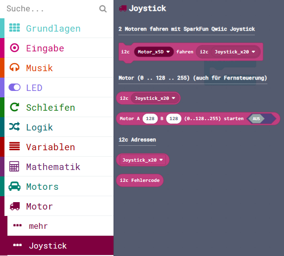
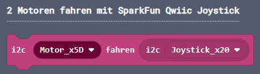
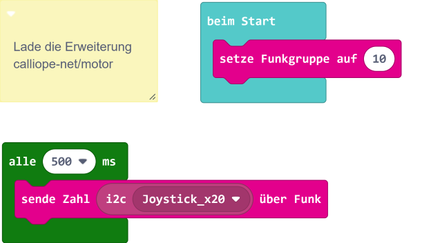
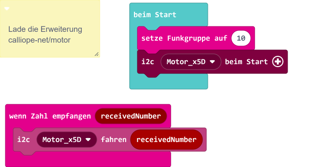

> Diese Seite bei [https://calliope-net.github.io/motor/](https://calliope-net.github.io/motor/) öffnen.

### Calliope Erweiterung für das i2c Modul:

* [SparkFun Qwiic Motor Driver](https://www.sparkfun.com/products/15451)

Dieses Repository kann als **Erweiterung** in MakeCode hinzugefügt werden.

* öffne [makecode.calliope.cc](https://makecode.calliope.cc)
* klicke auf eine Projektvorlage
* klicke unter dem Zahnrad-Menü auf **Erweiterungen** (oder bei den Blöcken ganz unten)
* kopiere die folgende **Projekt-URL** in die Zwischenablage (Strg-C)
* **calliope-net/motor**
* füge sie auf der Webseite oben ein (Strg-V) und klicke auf die Lupe (oder ENTER)
* wenn die Erweiterung gefunden wurde, klicke auf das Rechteck
* jetzt hat die Liste den neuen Eintrag **Motor** bekommen

### Beschreibung der Erweiterung für 'SparkFun Qwiic Motor Driver'

Mit dem Modul können zwei Motoren (3-11 V; 1,2 A) gleichzeitig vorwärts und rückwärts gesteuert werden. Dabei steht mehr Strom zur Verfügung,
als am Motor-Anschluss auf dem Calliope. Die Drehzahl kann in 127 Schritten rückwärts und 127 Schritten vorwärts eingestellt werden. 
128 (0x80) ist Stillstand. 0 ist max. rückwärts und 255 ist max. vorwärts. 

Mit (0 .. 128 .. 255) wird der Motor-Chip direkt angesteuert.

Zur Kompatibilität mit dem Calliope Motor Block, wird auch der Bereich (-100% .. 0% .. +100%) unterstützt. 
Hier kann der grafische Tachometer *speedPicker* zur Einstellung der Werte benutzt werden.
Die Umrechnung erfolgt mit dem Block *verteile* (Math.map) aus Mathematik.

Aus der [Arduino Library](https://github.com/sparkfun/SparkFun_Serial_Controlled_Motor_Driver_Arduino_Library) sind die
Parameter (0 .. 255) und ein zusätzlicher Parameter für die Richtung übernommen.

#### ... Joystick

Interessant ist die Steuerung von zwei Motoren mit dem [**SparkFun Qwiic Joystick**](https://calliope-net.github.io/joystick/). Alles, was Qwiic heißt, ist i2c und 3,3V Logik.
Der Joystick liefert in Mittelstellung jeweils den Wert 128 (0x80) - genau wie der Motor Driver es braucht.
So kann direkt der Wert (0 - 255) jeweils für horizontal und vertikal an das Register für Motor A und Motor B übertragen werden - in einer Zeitschleife von z.B. 500 ms.

Zusätzlich wird durch Drücken auf den Joystick *DRIVER_ENABLE* die ganze Elektronik (Pulsweitenmodulation PWM) erst eingeschaltet.
Am Calliope am linken i2c Anschluss A0 am Qwiic Kabel sind Joystick und Motor Driver hintereinander gesteckt.

Spätestens jetzt entsteht der Wunsch, mit zwei Calliope eine Fernsteuerung zu bauen. Es ist nicht so einfach, mehrere Zahlen gleichzeitig zu senden.
Weil es nur zwei mal 8 Bit sind, und ein drittes Byte für den gedrückten Button auf dem Joystick, lassen sich alle in einer 32-Bit *number* (UInt32LE) unter bringen.
Diese 32-Bit *Zahl* kann per Bluetooth mit einem Block im Ganzen gesendet werden. Und der Empfänger macht daraus wieder Bytes und schreibt sie in die Motor-i2c-Register.
Hier ist das ganze Programm für die Fernsteuerung:

Calliope Sender:

Calliope Empfänger:

#### ... mehr

Auf dem Qwiic-Modul können durch Lötbrücken 10 verschiedene i2c-Adressen eingestellt werden.
So könnten mit einem Calliope 10 Module und 20 Motoren gleichzeitig angesteuert werden.

Es sind alle (für dieses Qwiic Modul relevanten) Register des Chips mit Blöcken programmierbar. 
Dazu muss man sich mit der Dokumentation beschäftigen, die allerdings den Chip auf einem anderen (nicht i2c-Modul) beschreibt.

### Erweiterungen

> [Upates für Erweiterungen; Erweiterungen aus einem Projekt löschen.](https://calliope-net.github.io/i2c-liste#updates)

> [Alle i2c-Erweiterungen für MakeCode von calliope-net (Software).](https://calliope-net.github.io/i2c-liste#erweiterungen)

#### Calliope-Apps, .hex-Dateien, Bildschirmfotos mit Blöcken

> [Alle Beispiel-Projekte für MakeCode von calliope-net (Calliope-Apps).](https://calliope-net.github.io/i2c-liste#programmierbeispiele)

> GitHub-Profil calliope-net: [https://github.com/calliope-net](https://github.com/calliope-net)

### Bezugsquellen

> [Alle i2c-Module und Bezugsquellen (Hardware).](https://calliope-net.github.io/i2c-liste#bezugsquellen)

#### Metadaten (verwendet für Suche, Rendering)

* Calliope mini
* i2c
